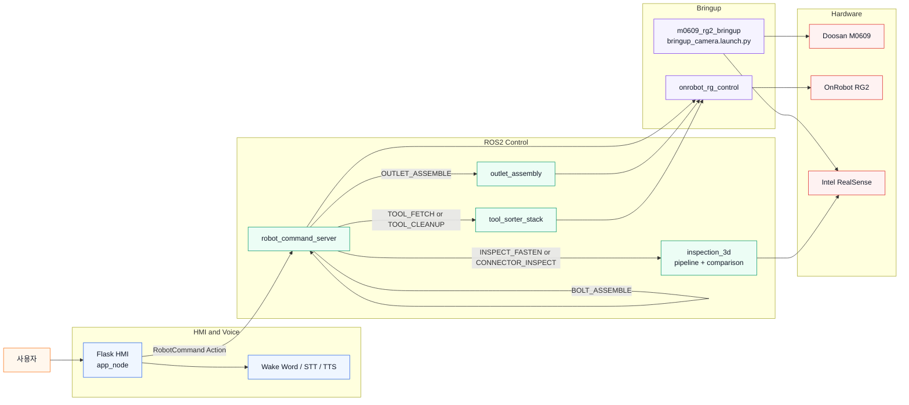
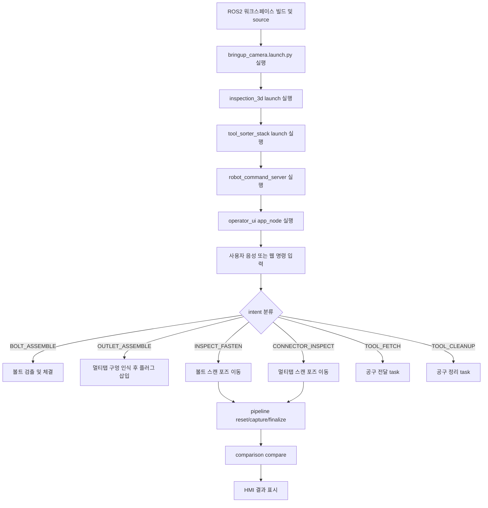
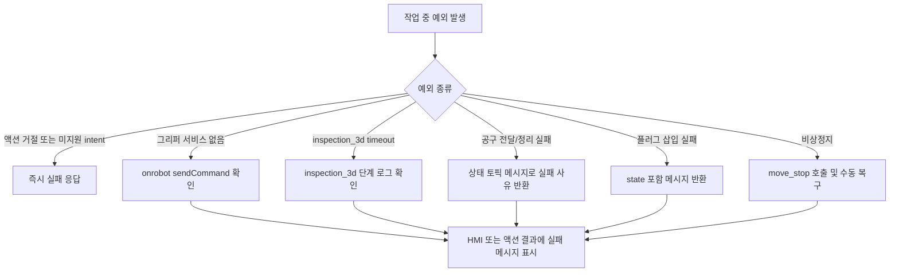

# VAAIS - Vision & Audio-guided Assembly & Inspection System

AI(Computer Vision) 기반 협동 로봇 작업 어시스턴트 구현 프로젝트  
두산 M0609 협동로봇, OnRobot RG2 그리퍼, RealSense 카메라, Flask HMI, ROS2 작업 제어 노드를 통합한 조립 및 검사 시스템입니다.  
현재 시스템은 다음 작업을 한 워크스페이스 안에서 함께 수행합니다.

- 볼트 체결
- 콘센트/멀티탭 체결
- 볼트 3D 검사
- 멀티탭 3D 검사
- 공구 가져오기
- 공구 정리
- 웹 HMI + 음성 인터페이스

---

## 1. 시스템 설계

### 1.1 전체 구성



### 1.2 작업 플로우



### 1.3 예외 처리 플로우



### 1.4 주요 ROS2 노드, 액션, 서비스

#### 핵심 노드

| 노드 | 실행 위치 | 역할 | 비고 |
| :--- | :--- | :--- | :--- |
| `app_node` | `operator_ui` | Flask HMI, 음성 인식, `robot_command` 액션 클라이언트 | 현재 음성의 기본 진입점 |
| `robot_command_server` | `robot_control` | intent를 실제 task 함수로 매핑하는 액션 서버 | 시스템 상위 제어 진입점 |
| `pointcloud_pipeline` | `inspection_3d` | PointCloud2 캡처, ICP 병합, finalize 저장 | 서비스 기반 |
| `pointcloud_comparison` | `inspection_3d` | 기준 PCD와 비교, 결과 생성 | 서비스 기반 |
| `tool_sorter_perception` | `tool_sorter_core` | 공구 인식/Scene 생성 | 공구 전달·정리 공통 |
| `tool_sorter_autonomous_task_manager` | `tool_sorter_cleanup` | 공구 정리 시퀀스 수행 | `TOOL_CLEANUP` 구현체 |
| `tool_sorter_handover_task_manager` | `tool_sorter_handover` | 공구 전달 시퀀스 수행 | `TOOL_FETCH` 구현체 |
| `OnRobotRGControllerServer` | `onrobot_rg_control` | RG2 드라이버 서비스 서버 | `/onrobot/sendCommand` 제공 |

#### 액션

| 액션명 | 타입 | 역할 | 비고 |
| :--- | :--- | :--- | :--- |
| `/dsr01/robot_command` | `voice_interfaces/action/RobotCommand` | HMI/음성 명령을 실제 로봇 작업으로 변환 | `robot_command_server`가 제공 |

#### inspection_3d 서비스

| 서비스명 | 타입 | 역할 |
| :--- | :--- | :--- |
| `/pointcloud_pipeline/reset` | `std_srvs/srv/Trigger` | 누적 점군 상태 초기화 |
| `/pointcloud_pipeline/capture` | `std_srvs/srv/Trigger` | 현재 PointCloud2를 받아 누적 병합 |
| `/pointcloud_pipeline/finalize` | `std_srvs/srv/Trigger` | ROI/필터링/DBSCAN 후 최종 PCD 저장 |
| `/pointcloud_comparison/compare` | `od_msg/srv/SrvPointCloudCompare` | 기준 PCD와 검사 PCD 비교 |

#### 공구 정리/전달 서비스와 토픽

| 이름 | 타입 | 역할 |
| :--- | :--- | :--- |
| `/integration/tool_sorter/organize` | `std_srvs/srv/Trigger` | 공구 정리 시작 |
| `/integration/tool_sorter/stop` | `std_srvs/srv/Trigger` | 공구 정리 중단 |
| `/tool_sorter/handover/start` | `std_srvs/srv/Trigger` | 공구 전달 세션 시작 |
| `/tool_sorter/handover/stop` | `std_srvs/srv/Trigger` | 공구 전달 세션 중단 |
| `/tool_sorter/handover/request` | `std_msgs/msg/String` | 전달할 공구 이름 요청 |

#### 그리퍼 서비스

| 서비스명 | 타입 | 역할 |
| :--- | :--- | :--- |
| `/onrobot/sendCommand` | `onrobot_rg_msgs/srv/SetCommand` | RG2 열기/닫기 명령 | 볼트 체결, 플러그 삽입, 공구 정리/전달이 공통 사용 |

---

## 2. 운영체제 환경

| 항목 | 환경 |
| :--- | :--- |
| OS | Ubuntu 22.04 LTS 권장 |
| ROS | ROS2 Humble 기준 |
| Python | Python 3.10 기준 |
| 로봇 | Doosan M0609 |
| 그리퍼 | OnRobot RG2 |
| 카메라 | Intel RealSense |

---

## 3. 권장 워크스페이스 구조

```text
~/cobot_ws/
├── build/
├── install/
├── log/
└── src/
    ├── cobot2_ws/
    │   ├── README.md
    │   ├── operator_ui/
    │   ├── robot_control/
    │   ├── inspection_3d/
    │   ├── od_msg/
    │   ├── voice_interfaces/
    │   ├── outlet_assembly/
    │   ├── tool_sorter_core/
    │   ├── tool_sorter_cleanup/
    │   └── tool_sorter_handover/
    ├── rg2/
    │   └── m0609_rg2_bringup/
    ├── onrobot-ros2/
    │   ├── onrobot_rg_control/
    │   ├── onrobot_rg_msgs/
    │   ├── onrobot_rg_description/
    │   └── _onrobot_rg_modbus_tcp/
    └── doosan-robot2/
        ├── dsr_bringup2/
        ├── dsr_common2/
        ├── dsr_controller2/
        ├── dsr_description2/
        ├── dsr_hardware2/
        └── dsr_msgs2/
```

---

## 4. 패키지 구성

| 패키지 | 역할 |
| :--- | :--- |
| `operator_ui` | Flask HMI, 통합 음성 인식, 액션 클라이언트 |
| `robot_control` | 상위 액션 서버, 볼트 체결, 3D 검사 orchestration, 공구 task 중계 |
| `inspection_3d` | 다중 시점 점군 캡처/ICP 병합/비교 |
| `od_msg` | inspection_3d 비교 서비스 타입 |
| `voice_interfaces` | `RobotCommand.action`, `GetKeyword.srv` 정의 |
| `outlet_assembly` | 콘센트/멀티탭 체결 구현체 |
| `tool_sorter_core` | 공구 인식, 공통 task manager, motion 유틸 |
| `tool_sorter_cleanup` | 공구 정리 구현체 |
| `tool_sorter_handover` | 공구 전달 구현체 |
| `../rg2/m0609_rg2_bringup` | 로봇 + RG2 + RealSense bringup |
| `../onrobot-ros2/*` | OnRobot RG2 드라이버 및 메시지 패키지 |

---

## 4.1 외부 의존성

`onrobot-ros2`와 `rg2`는 현재 `src/cobot2_ws` 바깥(`~/cobot_ws/src`)에 두는
외부 패키지로 관리합니다.  
따라서 본 저장소는 최종 제출본 기준으로 **OnRobot RG2 드라이버 패키지
(`onrobot-ros2`)를 포함하지 않을 수 있습니다.**  
이 경우 아래 패키지는 별도 워크스페이스 또는 외부 저장소에서 설치되어 있어야
합니다.

- `onrobot_rg_control`
- `onrobot_rg_msgs`
- `_onrobot_rg_modbus_tcp`

이 외부 의존성이 없으면 다음 기능은 정상 실행되지 않습니다.

- 볼트 체결
- 콘센트/멀티탭 체결
- 공구 가져오기
- 공구 정리
- 검사 시작 전 그리퍼 자동 개방

특히 `/onrobot/sendCommand` 서비스가 없으면 RG2 관련 작업은 모두 실패합니다.

---

## 5. 실행 방법

### 5.1 HMI 환경변수 설정

`operator_ui app_node`의 음성 기능(wake word, STT, TTS, LLM intent 보조 분류)은
`OPENAI_API_KEY`가 없으면 비활성화됩니다.  
다음 경로에 `.env` 파일을 두고 키를 설정해야 합니다.

```text
~/cobot_ws/src/cobot2_ws/operator_ui/resource/.env
```

예시:

```env
OPENAI_API_KEY=sk-...
```

주의:

- `.env`는 Git에 올리지 않습니다.
- 키가 비어 있으면 HMI 웹 서버는 떠도 음성 엔진은 시작되지 않습니다.
- `.env`를 수정한 뒤에는 `ros2 run operator_ui app_node`를 다시 실행해야 합니다.

### 5.2 실사용 실행 순서

현장에서는 보통 아래 순서로 띄웁니다.

1. `roboton`
   Doosan 로봇 bringup 및 기본 TF 트리를 활성화합니다.

2. `realsense`
   RealSense 카메라 드라이버와 RGB/depth 토픽을 활성화합니다.

3. `gripper 드라이버`
   OnRobot RG2 서비스 서버(`/onrobot/sendCommand`)를 활성화합니다.

4. 검사/체결/HMI 등 나머지 작업 노드
   inspection_3d, tool sorter, robot_command_server, operator_ui를 목적에 맞게
   실행합니다.

예시 명령:

```bash
source /opt/ros/humble/setup.bash
source ~/cobot_ws/install/setup.bash

ros2 launch dsr_bringup2 dsr_bringup2_rviz.launch.py mode:=real host:=192.168.1.100 port:=12345 model:=m0609
ros2 launch realsense2_camera rs_align_depth_launch.py depth_module.depth_profile:=848x480x30 rgb_camera.color_profile:=1280x720x30 initial_reset:=true align_depth.enable:=true enable_rgbd:=true pointcloud.enable:=true
ros2 launch onrobot_rg_control bringup.launch.py
ros2 launch inspection_3d pipeline_with_comparison.launch.py
ros2 launch robot_control tool_sorter_stack.launch.py
ros2 run robot_control robot_command_server
ros2 run operator_ui app_node
```

### 5.3 기능별 필요한 구성

| 기능 | 필요한 구성 |
| :--- | :--- |
| 볼트 체결 | `roboton` + `realsense` + `gripper 드라이버` + `robot_command_server` + `operator_ui` |
| 콘센트/멀티탭 체결 | `roboton` + `realsense` + `gripper 드라이버` + `robot_command_server` + `operator_ui` |
| 볼트/멀티탭 3D 검사 | 위 구성 + `inspection_3d` |
| 공구 가져오기/정리 | 위 구성 + `tool_sorter_stack` |

### 5.4 레거시 음성 경로

현재는 `operator_ui app_node`가 음성 인식까지 포함하므로 필수가 아니다.  
다만 과거 `voice_processing/get_keyword_node.py` 기반 경로를 유지해야 하면 아래 launch를 쓸 수 있다.

```bash
ros2 launch robot_control voice_command_stack.launch.py
```

이 launch는 다음 둘을 함께 띄운다.

- `robot_command_server`
- `voice_command_dispatcher`

---

## 6. 주요 명령과 intent 매핑

| 사용자 명령 | intent | 실제 구현체 |
| :--- | :--- | :--- |
| `볼트 체결해줘` | `BOLT_ASSEMBLE` | `robot_control/bolt_assemble_task.py` |
| `콘센트 체결해줘` | `OUTLET_ASSEMBLE` | `outlet_assembly/outlet_assembly/plug_insert_task.py` |
| `멀티탭 체결해줘` | `OUTLET_ASSEMBLE` | `outlet_assembly/outlet_assembly/plug_insert_task.py` |
| `볼트 검사해줘` | `INSPECT_FASTEN` | `robot_control/pointcloud_inspector_task.py` |
| `멀티탭 검사해줘` | `CONNECTOR_INSPECT` | `robot_control/pointcloud_inspector_task.py` |
| `망치 가져와줘` | `TOOL_FETCH` | `robot_control/tool_handover_task.py` |
| `공구 정리해줘` | `TOOL_CLEANUP` | `robot_control/tool_cleanup_task.py` |

---

## 7. HMI 및 음성 구조

현재 `operator_ui/app_v5.py`는 다음 역할을 한 프로세스에서 함께 수행합니다.

- Flask 웹 서버
- ROS2 브리지 노드
- wake word 감지
- OpenAI Whisper 기반 STT
- OpenAI TTS 기반 안내 음성
- `robot_command_server` 액션 호출
- inspection_3d 결과 파일 조회

음성 처리 흐름:

1. wake word 감지
2. STT 녹음
3. 문장 분류
4. `robot_command` 액션 전송
5. 액션 결과를 TTS와 HMI 로그로 안내

---

## 8. Pointcloud 저장 구조

현재 3D 검사 결과는 HMI가 바로 읽을 수 있게 다음 위치에 저장됩니다.

```text
src/cobot2_ws/operator_ui/pointclouds/
├── bolt/
│   ├── references/
│   └── captures/
└── outlet/
    ├── references/
    └── captures/
```

- 볼트 검사 결과: `bolt/captures/`
- 멀티탭 검사 결과: `outlet/captures/`

기준 PCD:

- `inspection_3d/resource/good_bolt.pcd`
- `inspection_3d/resource/good_multitap.pcd`

---
